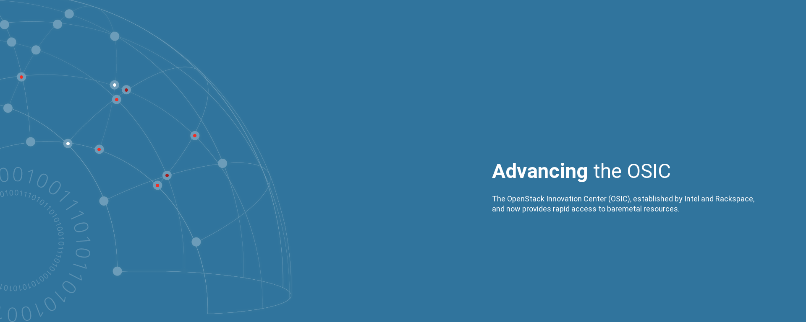

### VM (Nova) compute capacity

Capacity metrics are derived from our realtime metric collection system. More data on available VM capacity can be [found here](https://cloud1.osic.org/grafana/dashboard/db/openstack-all-compute-aggregates).

### Baremetal (Ironic) Node Capacity

Capacity metrics are derived from our realtime metric collection system. More data on available Baremetal capacity can be [found here](https://cloud1.osic.org/grafana/dashboard/db/openstack-ironic-baremetal-insights).

----

##### Consumer Information:
  - [Getting Started](user-getting-started.md)
  - [Getting SSH Access](user-getting-ssh.md)
  - [Getting HTTP Access](user-getting-http.md)
  - [Getting Baremetal nodes](user-getting-baremetal.md)

##### Administrative Information:
  - [Building Ironic Images](admin-building-images.md)
  - [Enrolling new nodes into Ironic](admin-node-enrollment.md)

##### General Notes:
  - [Notes](notes.md#notes)
