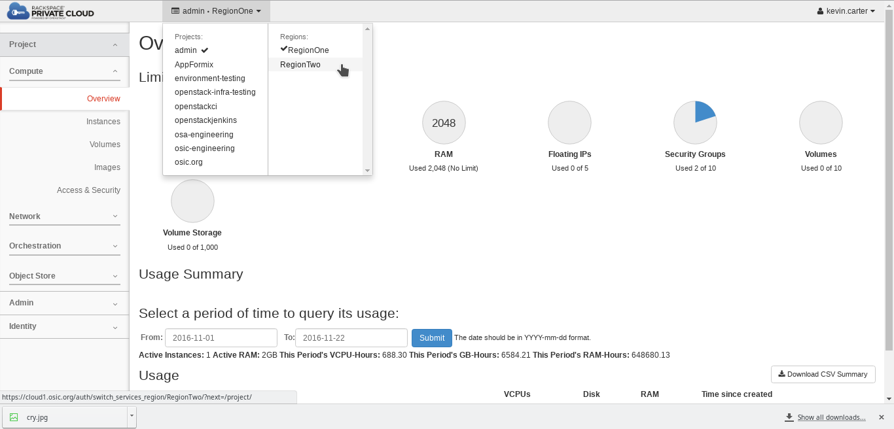
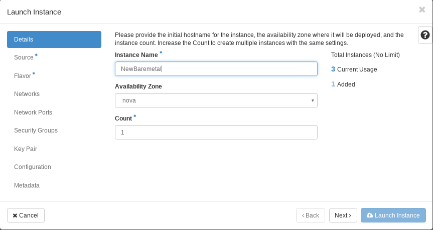
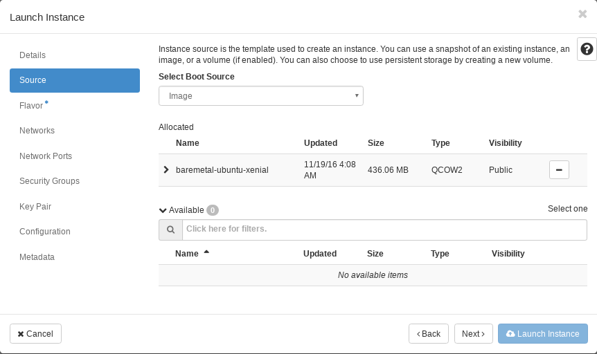
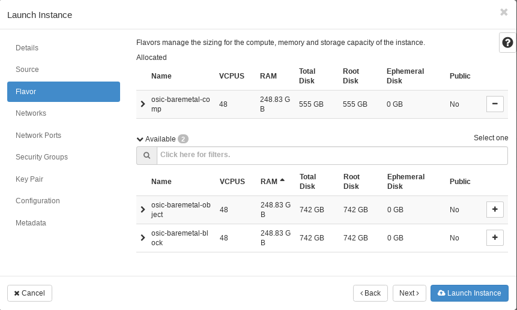
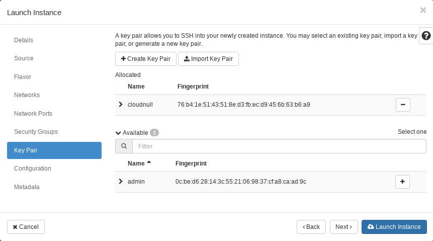

#### Building Baremetal nodes

Creating a baremetal nodes is just as simple as building new VMs. To create the baremetal nodes you will need to access RegionTwo from within Horizon and provision nodes based on the assigned quota from within your project.

1. Login to the cloud and access the "Instances" pane in "RegionTwo" and then select "Launch Instance. 

2. Boot the new Instance:
  1. Name the node: ***Also notice** that you can provision multiple nodes at the same time. This is handy when you're creating a lot of hosts all of the same type and image.*
    
  2. Select the Image:
    
  3. Select the Flavor: **Notice** there are three flavor types each building a physical node with different storage characteristics.
    
  4. Add you key to the node. If you do not do this now you will need to start over as there will be no access provided to the physical resource.
    

3. Wait for your nodes to come online and **be patient** as getting physical resources online can take a little while. When the nodes are active you will be able to use your jump box to access the resources.
