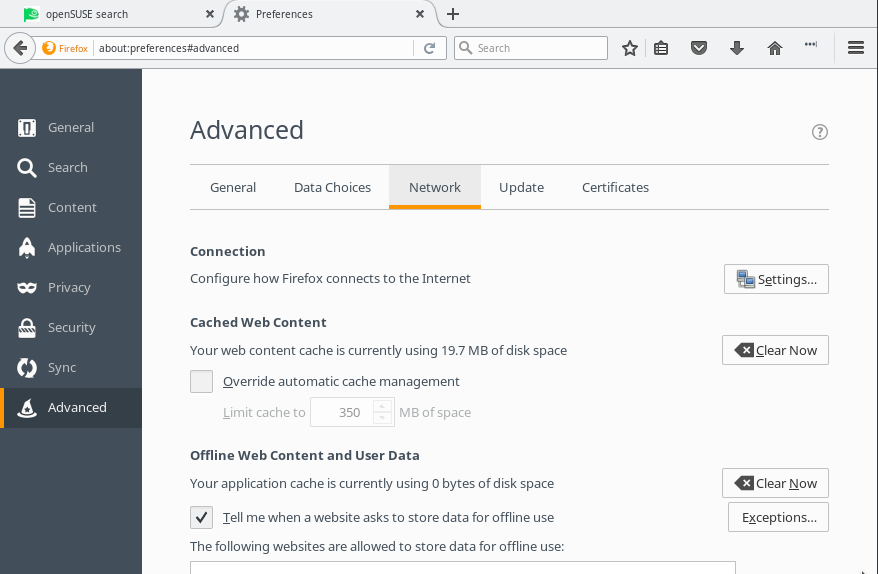
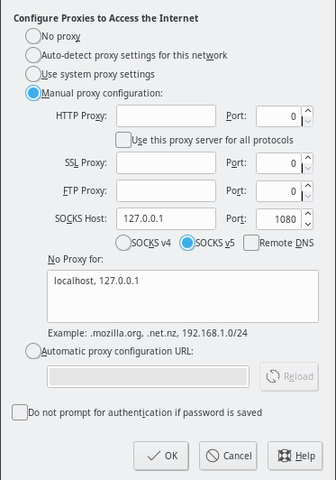
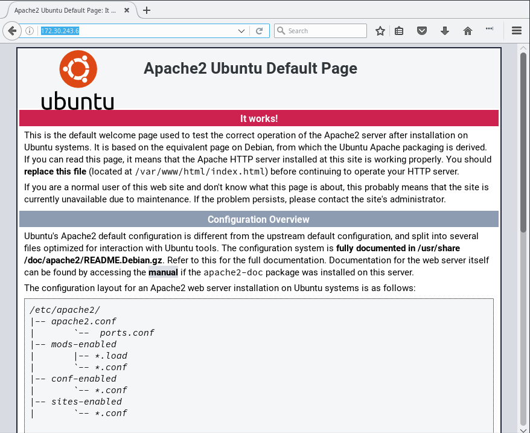

#### Getting HTTP Access

Once you're able to ssh to a target node the ssh config will setup a SOCKS proxy allowing you to establish an HTTP connection to your cluster. To access the SOCKS proxy you will need to setup your browser accordingly.

The following example shows how to configure Firefox using a SOCKS proxy.

1. Start Firefox.

2. Access the Firefox settings panel
  - Navigate to the "Network" tab within the Firefox settings panel. 

  - Click "**Settings...**" under the "*connection*" section from within the "network" tab. 

  - Select "Manual proxy configuration:" and add "127.0.0.1" to the **SOCKS Host:** box using port "1080". Then in the **No Proxy For:** text box add "localhost, 127.0.0.1". Now click "OK".
3. Exit the settings window and tabs.

4. You will now have HTTP access to the nodes within your environment. Simply navigate to the IP address of a given node within your browser. 
