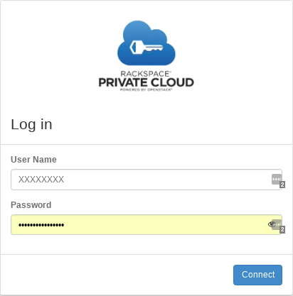
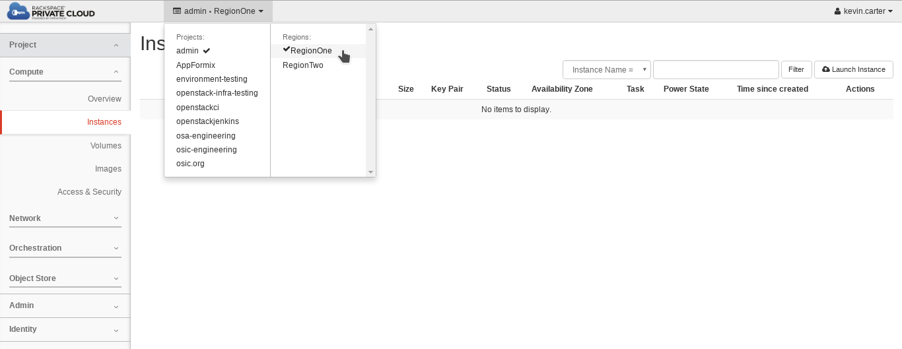
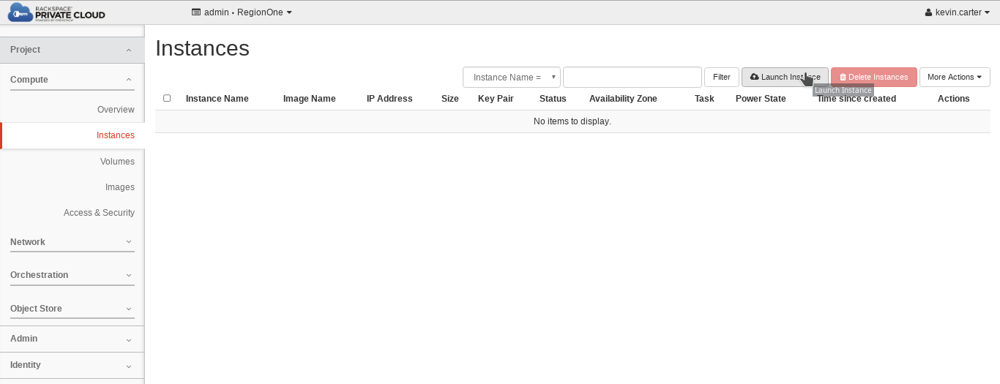
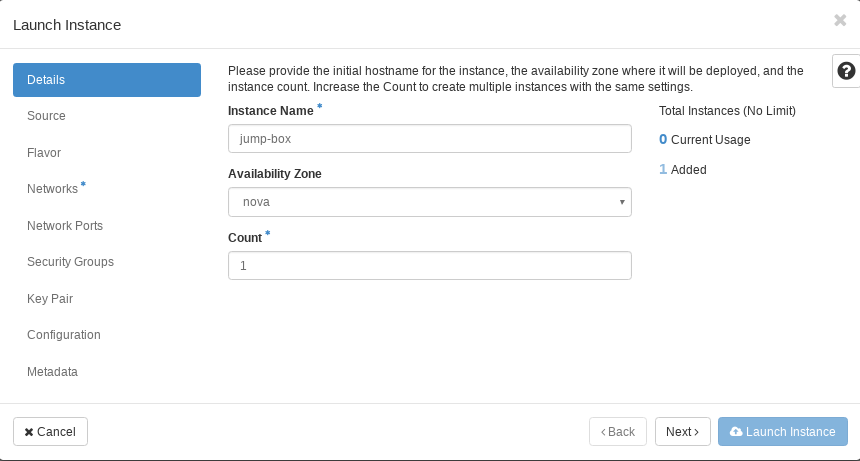
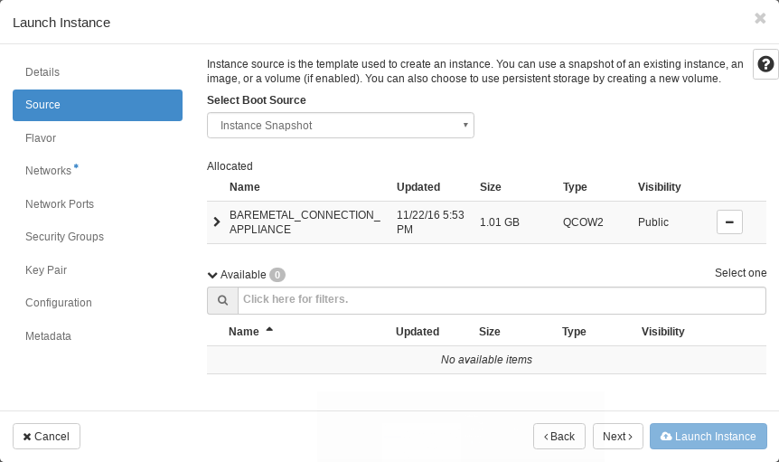
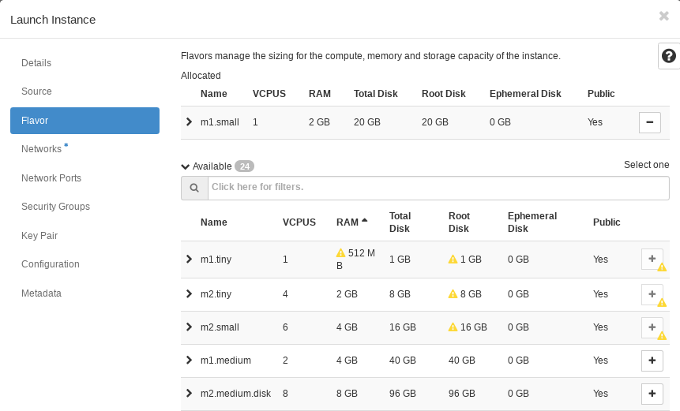
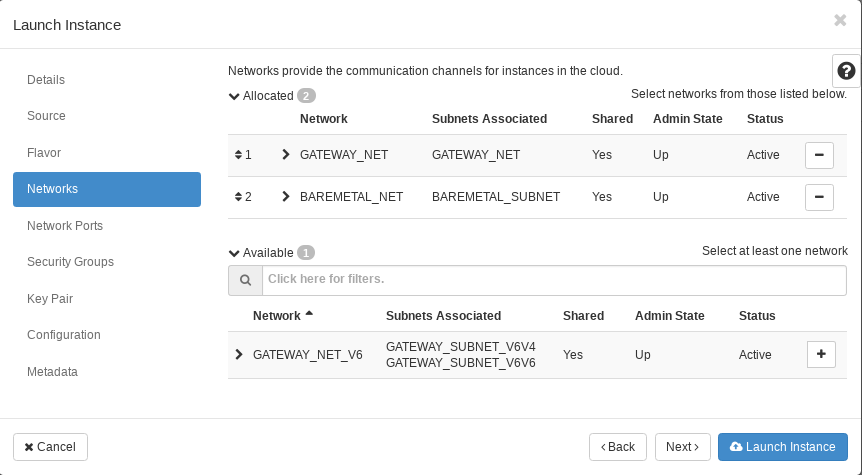
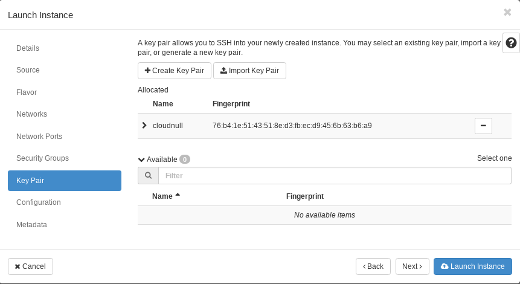

#### Getting started

1. Login to the OSIC at "https://cloud1.osic.org":

  

2. Access Cloud1 **"RegionOne"** to build your jump box:

  

3. Create a VM:

  

4. Name the VM:

  

5. Select the baremetal appliance image: *Note that the image used for accessing baremetal is an "Instance Snapshot".*

  

6. Select the flavor: *The flavor used does not need many resources. I recommend simply using ``m1.small``.*

  

7. Add networks to the VM: *The VM will need to use 2 networks. **GATEWAY\_NET** will be the first network and **BAREMETAL\_NET** will be the second. This combination will allow for public access using an IPv4 network and pass through for baremetal.*

  

8. Add your key to the VM: *If you fail to add an SSH key to the node you will not have access and will need to start over.*

  
